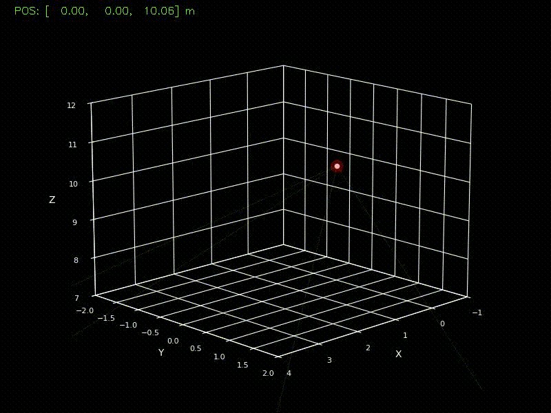

# blight
Resolves a target's 3D position by fusing data from four synchronized camera feeds and utilizing visual hull reconstruction and ray triangulation. The program is also capable of 3D plotting of the reconstructed path (see demo visualization below). Currently works in a simulation environment - a Blender generated scene using four cameras.
